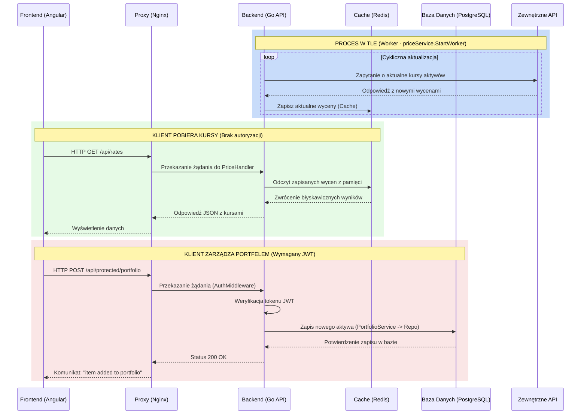

# Financial Data Aggregator

[](https://golang.org/)
[](https://angular.io/)
[](https://www.docker.com/)
[](https://www.postgresql.org/)
[](https://redis.io/)

Aplikacja webowa służąca do agregacji danych finansowych oraz zarządzania własnym portfelem inwestycyjnym. 

---

## Stos technologiczny

### Backend
* **Język:** Go
* **Framework:** Gin
* **ORM:** GORM
* **Architektura:** Wzorzec CSR (Controllers (Handlers), Services, Repositories)

### Frontend
* **Język:** TypeScript
* **Framework:** Angular, TailwindCSS

### Infrastruktura & Bazy danych
* **Baza główna:** PostgreSQL (dane użytkowników, transakcje, portfolio)
* **Cache:** Redis (cache cen aktywów)
* **Konteneryzacja:** Docker, Docker Compose
* **Serwer WWW / Proxy:** Nginx

---

## Model architektury

System opiera się na architekturze mikroserwisowej z wyodrębnionym backendem i frontendem, które komunikują się za pomocą REST API.



* [Dokumentacja API](docs/models/api.md)
* [Model bazy danych](docs/models/db_model.md)

---

## Instrukcja uruchomienia (Docker)

Aplikacja jest w pełni skonteneryzowana. Aby uruchomić projekt lokalnie, upewnij się, że masz zainstalowanego **Dockera** oraz **Docker Compose**.

### Krok 1: Klonowanie repozytorium
```bash
git clone [https://github.com/r4qq/financial-data-aggregator.git](https://github.com/r4qq/financial-data-aggregator.git)
cd financial-data-aggregator
```

### Krok 2: Konfiguracja środowiska
Skopiuj przykładowy plik konfiguracyjny i dostosuj go:
```bash
cp .env.example .env
```

### Krok 3: Uruchomienie aplikacji
Aby zbudować i uruchomić wszystkie kontenery (Baza danych, Cache, Backend, Frontend) w tle, wykonaj:
```bash
docker-compose up -d --build
```

### Krok 4: Weryfikacja działania
Po udanym uruchomieniu aplikacja będzie dostępna pod następującymi adresami:
* **Frontend:** `http://localhost:80`
* **Backend API:** `http://localhost:8080/api`

---

## Live:

Projekt został wdrozony i jest dostępny pod adresem:
**[Live](https://fin.krzysztofstasiak.pl/)**

---

## Autorzy:

 * Krzysztof Stasiak
 * Stanisław Rak