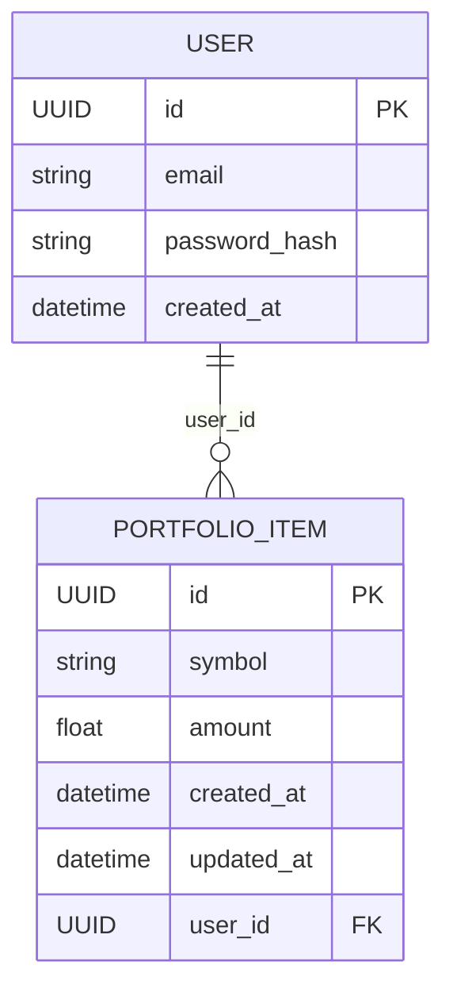

```mermaid
erDiagram
    USER ||--o{ PORTFOLIO_ITEM : user_id
   
    USER {
        UUID id PK
        string email
        string password_hash
        datetime created_at
    }
    PORTFOLIO_ITEM {
        UUID id PK
        string symbol
        float amount
        datetime created_at
        datetime updated_at
        UUID user_id FK
    }
```